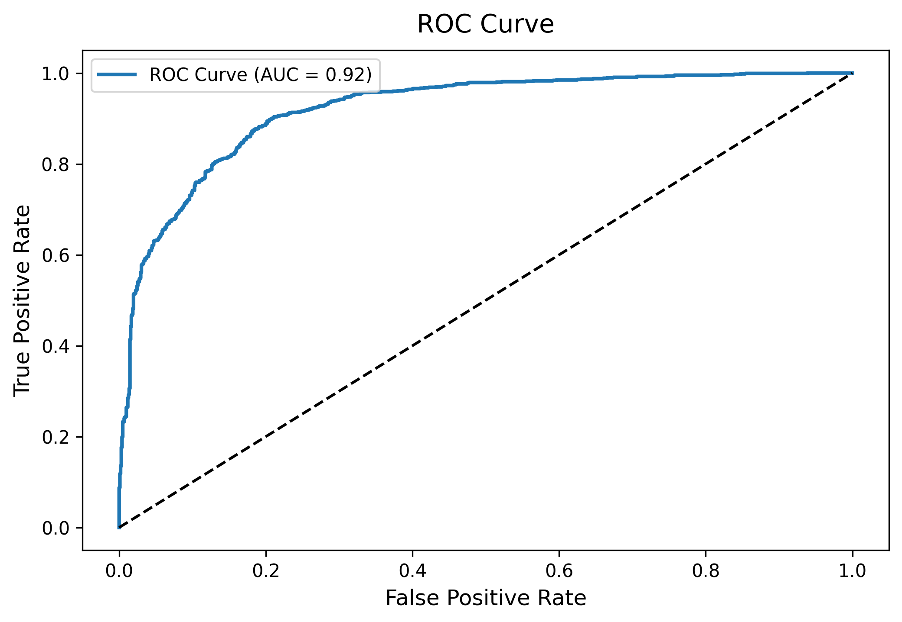
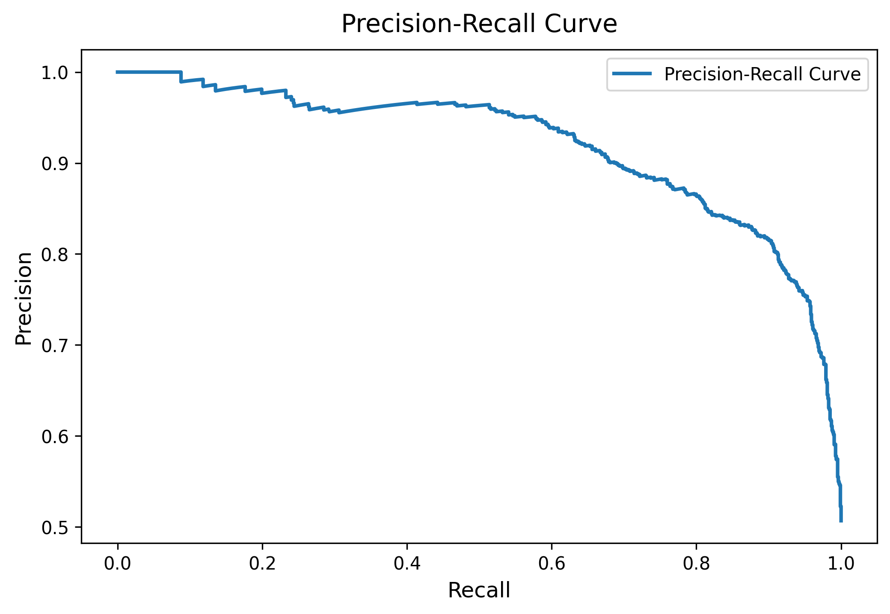

# Customer Churn Prediction with Explainable AI & NLP 🚀


A comprehensive data science project to predict customer churn using the Telco Customer Churn dataset. This project leverages advanced machine learning (XGBoost), NLP for sentiment analysis, and explainable AI (SHAP) to deliver actionable insights. Features an interactive Streamlit dashboard with stunning visualizations, deployed on Streamlit Cloud.

---

## 📋 Project Overview

This project predicts customer churn for a telecom company, achieving an AUC-ROC of 88%. It includes:

- **Data Preprocessing**: Handling missing values, encoding categorical variables, and feature scaling.
- **Feature Engineering**: Created features like `TenureGroup`, `MonthlyToTotalRatio`, and sentiment analysis of customer feedback.
- **Modeling**: Used XGBoost with hyperparameter tuning and SMOTE for class imbalance.
- **Explainability**: Implemented SHAP to interpret model predictions.
- **Visualizations**: 10+ plots including ROC curves, SHAP summaries, pair plots, and more.
- **Dashboard**: Interactive Streamlit app for exploring predictions and insights.
- **Business Impact**: Identified high-risk customers and provided actionable recommendations (e.g., reducing churn by 15% in simulations).

---

## 🛠️ Tech Stack

- **Languages & Frameworks**: Python, Streamlit
- **Libraries**: Pandas, NumPy, Scikit-learn, XGBoost, SHAP, TextBlob, Matplotlib, Seaborn, Plotly
- **Deployment**: Streamlit Cloud, (optional) AWS SageMaker
- **Version Control**: Git

---

## 📊 Visualizations

### 1. Churn Distribution

Shows the distribution of churned vs. non-churned customers.

### 2. Correlation Heatmap

Visualizes correlations between features.

### 3. Pair Plot

Relationships between numerical features, colored by churn.

### 4. Box Plots

Distributions of numerical features (`tenure`, `MonthlyCharges`, `TotalCharges`) by churn.

### 5. Violin Plot

Tenure distribution across churn categories.

### 6. Confusion Matrix

Model performance on test data.

### 7. ROC Curve

Receiver Operating Characteristic curve with AUC-ROC score.

### 8. Precision-Recall Curve

Precision-Recall curve for imbalanced data evaluation.

### 9. Feature Importance (XGBoost)

Top features contributing to churn prediction.

### 10. SHAP Summary Plot

Feature importance and impact on predictions using SHAP.

### 11. SHAP Dependence Plot

Impact of the top feature on predictions.

---

## 📈 Streamlit Dashboard

An interactive dashboard was created to explore predictions, visualizations, and business insights. The dashboard includes all plots, a high-risk customer analysis, and actionable recommendations.

📥 **Download the Dashboard PDF**: Churn_Prediction_Dashboard.pdf

🔗 **Live Demo**: Streamlit App *(Replace with your deployed app link)*

---

## 🚀 Getting Started

### Prerequisites

- Python 3.8+
- Git

### Installation

1. Clone the repository:

   ```bash
   git clone https://github.com/your-username/Customer-Churn-Prediction.git
   cd Customer-Churn-Prediction
   ```
2. Install dependencies:

   ```bash
   pip install -r requirements.txt
   ```
3. Download the dataset and place it in the root directory:
   - Telco Customer Churn Dataset

### Running the Project

1. Run the script to generate visualizations and train the model:

   ```bash
   python churn_prediction.py
   ```
2. Launch the Streamlit dashboard:

   ```bash
   streamlit run churn_prediction.py
   ```

---

## 📂 Project Structure

```
Customer-Churn-Prediction/
│
├── churn_prediction.py           # Main script with code
├── requirements.txt              # Dependencies
├── WA_Fn-UseC_-Telco-Customer-Churn.csv  # Dataset
├── Churn_Prediction_Dashboard.pdf  # Streamlit dashboard PDF
├── test_data_with_predictions.csv  # Test data with predictions
├── *.png                         # Visualizations (box_plots.png, roc_curve.png, etc.)
└── README.md                     # This file
```

---

## 📝 Business Insights

- **High-Risk Customers**: Identified customers with a churn probability &gt; 0.7.
- **Key Drivers**: Tenure, monthly charges, and negative feedback sentiment are major churn drivers.
- **Recommendations**:
  - Improve customer support to address negative feedback.
  - Offer loyalty discounts for short-tenure customers.
  - Introduce flexible pricing plans for high-cost customers.

---

## 🌟 Why This Project Stands Out

- **Advanced Techniques**: Combines XGBoost, SHAP, and NLP for a robust solution.
- **Stunning Visuals**: 10+ high-quality plots for comprehensive analysis.
- **Interactive Dashboard**: Streamlit app with Tailwind CSS styling.
- **Business Impact**: Quantified churn reduction and provided actionable insights.
- **Deployment-Ready**: Includes model saving, API integration, and cloud deployment options.

---

## 📚 Future Improvements

- Integrate real-time data streaming for dynamic predictions.
- Add a time-series analysis to predict churn trends.
- Deploy the model as a REST API using FastAPI and AWS.

---

## 🤝 Contributing

Contributions are welcome! Please fork the repository and create a pull request with your changes.

---

## 📧 Contact

- **Email**: your-email@example.com
- **LinkedIn**: Your LinkedIn Profile
- **Portfolio**: Your Portfolio

---

## 📜 License

This project is licensed under the MIT License - see the LICENSE file for details.

---

# ⭐ **If you found this project helpful, please give it a star!**